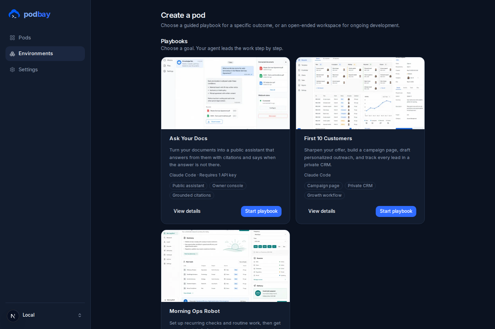

# Podbay, self-hosted

**Give Claude Code a persistent computer on hardware you control.**

Podbay runs Claude Code in a dedicated Docker container with your project, tools, terminal, and
live app preview. Open it in your browser or continue from the Claude desktop and mobile apps. It
uses your existing Claude Pro or Max subscription, so you do not need an Anthropic API key or pay
Podbay a separate agent-usage bill.



> [!IMPORTANT]
> **Podbay Self-Hosted is an early alpha.** It is released for local experiments and early feedback,
> but expect rough edges and occasional breaking changes. The public installer is available now;
> a buildable source release is being prepared.

## What you get

- **A workspace that stays put.** Your project, tools, and agent live together in one pod instead
  of being recreated for every session.
- **Claude where you already use it.** Work in the browser terminal, then continue through Claude
  Remote Control on desktop or mobile.
- **A live development environment.** Each pod can run a dev server and gives you a direct preview
  link.
- **Control over the machine.** Pods run as Docker containers on your computer or server, using
  its storage and network connection.

## Install Podbay

You need Docker Desktop or Docker Engine with Compose v2, at least 8 GB of memory, about 6 GB of
free disk space, and a Claude Pro or Max subscription. The installer works from macOS and Linux
shells, or from WSL2 on Windows.

```sh
curl -fsSL https://raw.githubusercontent.com/podbay-cloud/install/main/install.sh | sh
```

The installer checks your machine, downloads the Compose configuration into `./podbay`, and pulls
the Podbay images. First startup takes longer while those images download.

When it finishes:

1. Open [http://localhost:8080](http://localhost:8080).
2. Create the single owner login. This protects the dashboard and browser terminal.
3. Select **Create a pod** and choose a playbook or workspace.
4. Follow the sign-in link and enter the code from your Claude account.
5. Open the pod to use its terminal, app preview, or Claude Remote Control session.

<details>
<summary><strong>Prefer to inspect the files and run Docker Compose yourself?</strong></summary>

Review the public [`install.sh`](https://github.com/podbay-cloud/install/blob/main/install.sh) and
[`compose.yaml`](https://github.com/podbay-cloud/install/blob/main/compose.yaml), then run:

```sh
mkdir podbay && cd podbay
curl -fsSL https://raw.githubusercontent.com/podbay-cloud/install/main/compose.yaml -o compose.yaml
docker compose up -d
```

</details>

## Know before you deploy

- **This is a single-owner edition.** The built-in login protects the dashboard and browser
  terminal; it is not a multi-user access-control system.
- **Local or private-network use is still recommended.** Remote deployment is experimental, pod
  ports need Docker-aware firewall rules, and app-preview links currently work only on the Docker
  host. Read the deployment and security guides before using a server.
- **The host must remain online.** A pod cannot keep working while its Docker host is asleep or
  disconnected.
- **A pod is not a backup.** Deleting a pod deletes its container and workspace. Commit important
  work to Git or export it first.
- **Podbay has powerful host access.** The dashboard controls Docker so it can create and manage
  pods. Only run it on a machine where you trust the people who can reach the dashboard.

## Documentation

- [Deployment](docs/DEPLOYMENT.md) — supported hosts, ports, private access, remote-host guidance,
  and configuration
- [Operations](docs/OPERATIONS.md) — logs, updates, backups, stopping, uninstalling, and common
  problems
- [Architecture](docs/ARCHITECTURE.md) — the containers, networks, data, and trust boundaries
- [Security](docs/SECURITY.md) — current limitations, exposure risks, secrets, and reporting a
  vulnerability

## Source and licensing

The buildable self-hosted source is being prepared for publication. It will include the dashboard,
local control plane, gateway, pod agent, Docker provider, default environments, image build files,
and the tests needed to reproduce the published images. Podbay's managed-cloud orchestration and
operator tooling will remain separate.

Until that source and its license are published, this repository is the public self-hosted
installer—not the source distribution.

## Help and feedback

This edition is being shaped with early users. Report reproducible bugs and installation problems
in [GitHub Issues](https://github.com/podbay-cloud/install/issues). For the managed version, visit
[podbay.cloud](https://podbay.cloud).
